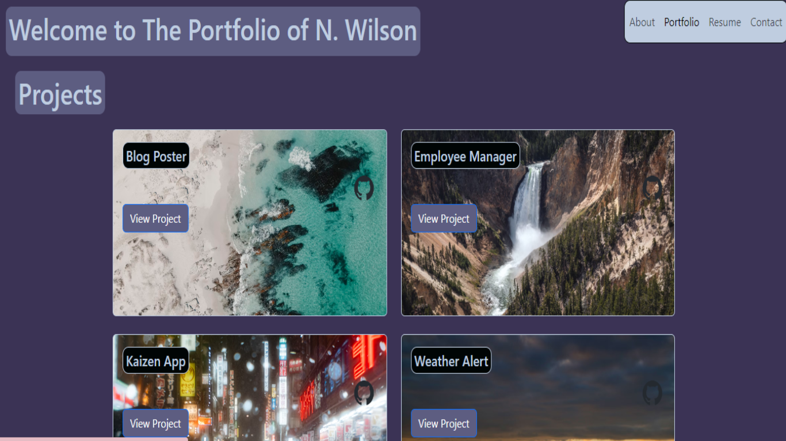

# Portfolio

A portfolio holding my works in one place with a resume and about page for future employers to see.

## Description

This app utilizes React, Bootstrap, and Vite to create a portfolio. In order to learn React and React Bootstrap, I made this to see what I could do with it while making a nice, professional portfolio showcasing my projects, experience, and more. I particularly enjoyed learning React Bootstrap, as the syntax is very simple and straightforward, but the entire project was a great learning experience that left me feeling confident in using React in the future. This portfolio uses EmailJS to send messages from the contact page to the my email directly, telling me the name, email, and message from the page. When the email is sent, an alert confirms it with user.

## Preview

## Usage

If you would like to use my resume, the link to the Netlify page can be found here; [LINK](https://main--personal-react-portfolio.netlify.app/#about). To use simply open the page, and click on the navbar to the right corner to see the different pages.

## Future Plans

Also, I want to tweak the page's images to be outside urls to save loading, and I want to implement a way to transition from one image in the background to another more smoothly in the Resume page.

## Credits

Photographers of stock images used for back-end database's placeholder can be found here; stock1 [LINK](https://unsplash.com/@jooris), stock2 [LINK](https://unsplash.com/@taro_ohtani), stock3 [LINK](https://unsplash.com/@uranwang) , stock4 [LINK](https://unsplash.com/@timmossholder).